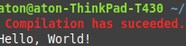

# Fast c compiler

Fast c compiler is a little bash script to make execution in c as easy as in python.

Here is what it looks like once set up on "Hello, world !" code.


## Installation 

**1)** Clone this repo by doing the following in your terminal

```bash
git clone 
```

**2)** Get into the cloned directory (you should see Fast c compiler when typing "pwd"  in your terminal )

**3)** type the following and type password 

```bash
sudo mv c /bin
```

**4)** Enjoy, issue me if you want to set up some new colors.



**Note**:  Your c file has to have the .c extension et will be output as a .o

